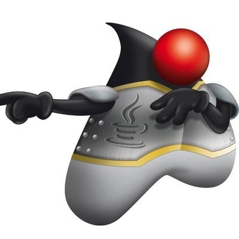
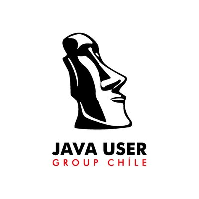
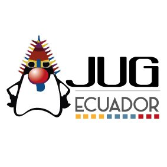
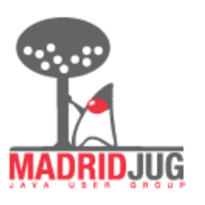
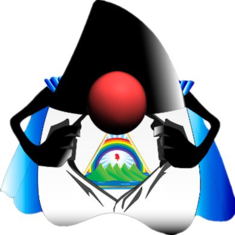
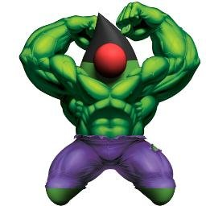

# Nuestra comunidad

 

La Comunidad Hispana de grupos de usuarios de Java (JUG) inicio en el año 2017 para compartir conocimiento sobre Java y tecnologias relacionadas entre JUGs donde su idioma principal es el Español, mas de 12 grupos de España y Latinoamerica hacen parte de esta comunidad.

Esta comunidad esta programando Hack days cada 2 meses, en donde los interesados pueden ir a la reunión de su JUG local o seguir el evento via YouTube and el canal de Slack.

Los siguientes son los grupos de usuarios de Java que hacen parte de la comunidad

- Barcelona
 

- Barranquilla

- Cali

- Chile

- Coruña

- Ecuador

- Guatemala

- Madrid

- Málaga

- Medellin

- Nicaragua

- Perú

- Panama

- Vigo

