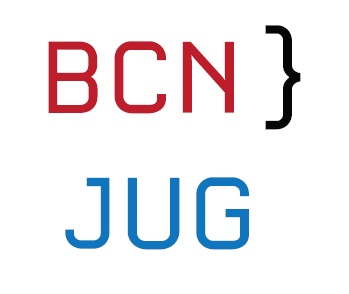
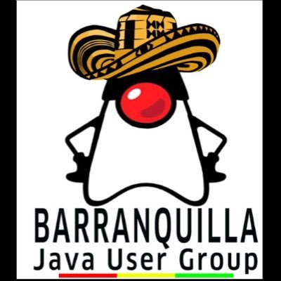
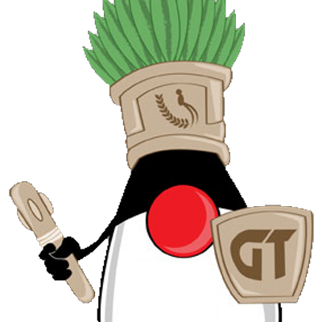
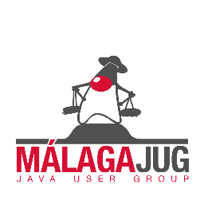
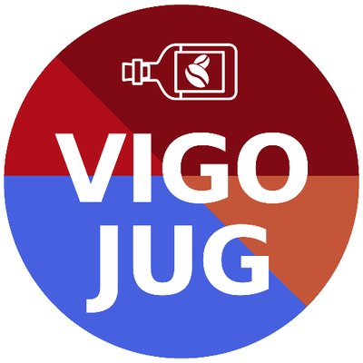

# Nuestra comunidad

 [**Click here to go to English version**](README_en.md)

 

La Comunidad Hispana de grupos de usuarios de Java (JUG) fue creada para comparrir conocimiento de Java y nuevas tecnologias entre JUGs donde su idioma prinicial es el Español, esta comunidad inicio en el año 2017 despues de una Hack Day de Java 9, mas de 12 grupos de España y Latinoamerica hacen parte de esta comunidad.

Las sesiones son transmitidas vias HangOuts on air y Youtube, quienes desean participar pueden hacerlo yendo a la reunión que organiza el JUG de su ciudad o seguir el evento via YouTube y el canal de Slack: comunidad-jugs.slack.com

Nuestra comunidad une alrededor de 200 miembros en cada sesion de hackday a traves de todos JUGs. 

Los siguientes son los grupos de usuarios de Java que hacen parte de la comunidad

- Barcelona [(@BarcelonaJUG)](https://twitter.com/BarcelonaJUG):
 

- Barranquilla [(@JUGBAQ)](https://twitter.com/JUGBAQ):

- Cali [(@CLOJUG)](https://twitter.com/CLOJUG):

- Chile [(@jug_chile)](https://twitter.com/jug_chile):

- Coruña [(@CorunaJUG)](https://twitter.com/CorunaJUG):

- Ecuador [(@EcuadorJUG)](https://twitter.com/EcuadorJUG):

- Guatemala [(@guatejug)](https://twitter.com/guatejug):

- Madrid [(@MadridJUG)](https://twitter.com/MadridJUG):

- Málaga [(@MalagaJUG)](https://twitter.com/MalagaJUG):

- Medellin [(@MedellinJug)](https://twitter.com/MedellinJug):

- Nicaragua [(@jug_nicaragua)](https://twitter.com/jug_nicaragua):

- Perú [(@perujug)](https://twitter.com/perujug):

- Panama

-República Dominicana [(@JavaDominicano)](https://twitter.com/javadominicano):  

- Vigo [(@VigoJUG)](https://twitter.com/VigoJUG):

