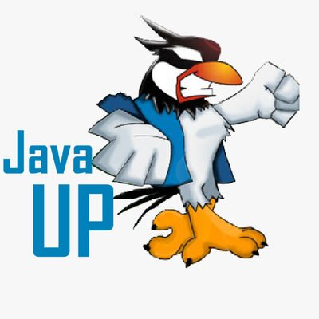

# Our community

 [**Clic aqui para ir a la versión en Español**](README.md)
 
 

The Java Users Groups' Hispanic Community was created to share Java and new technologies knowledge between Spanish-speaking JUGs, it started since 2017 after a Hack Day for Java 9, more than 12 JUGs from Spain and Latin America are part of this community. 

The sessions are spreading through Hangouts on air and Youtube, attendees can join each session by going to their local JUG meeting or online through youtube, they can also use a slack channel: comunidad-jugs.slack.com. 

The community joins around 200 members each hack day session through all JUGs. 

* Community's slack channel

https://join.slack.com/t/comunidad-jugs/shared_invite/enQtNDAyNzEzNTUzNTEwLWIyN2I2N2U2NWNjMDkxMWI3Njk1NDJkZTU2NDU1MDBlYWNmNzRhNTRiMWJkZGYxNWU1ZTEzMTQ2NDUyZjVmYWQ

These Java Users Groups are part of this community:

- Barcelona [(@BarcelonaJUG)](https://twitter.com/BarcelonaJUG):
 

- Barranquilla [(@JUGBAQ)](https://twitter.com/JUGBAQ):

- Cali [(@CLOJUG)](https://twitter.com/CLOJUG):

- Chile [(@jug_chile)](https://twitter.com/jug_chile):

- Coruña [(@CorunaJUG)](https://twitter.com/CorunaJUG):

- Ecuador [(@EcuadorJUG)](https://twitter.com/EcuadorJUG):

- Guatemala [(@guatejug)](https://twitter.com/guatejug):

- Madrid [(@MadridJUG)](https://twitter.com/MadridJUG):

- Málaga [(@MalagaJUG)](https://twitter.com/MalagaJUG):

- Medellin [(@MedellinJug)](https://twitter.com/MedellinJug):

- México [(@JavaUp)](https://twitter.com/javaup):

- Nicaragua [(@jug_nicaragua)](https://twitter.com/jug_nicaragua):

- Perú [(@perujug)](https://twitter.com/perujug):

- Panama

- República Dominicana [(@JavaDominicano)](https://twitter.com/javadominicano)

- Vigo [(@VigoJUG)](https://twitter.com/VigoJUG):

