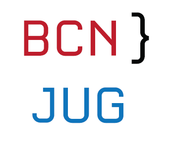
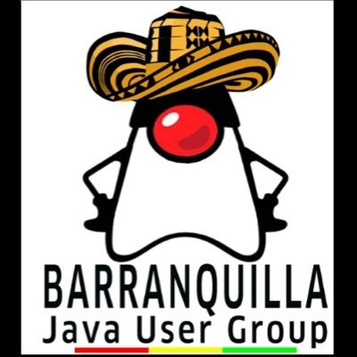
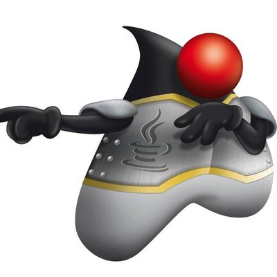
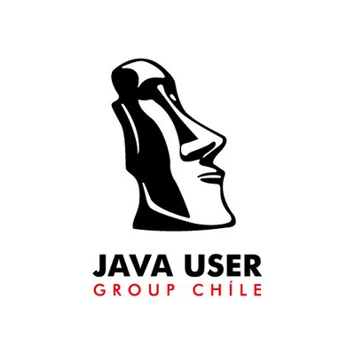
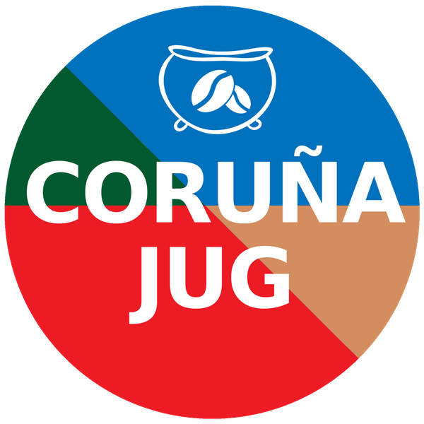
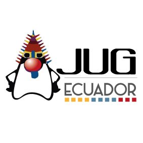
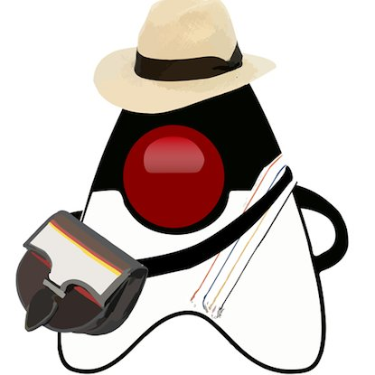
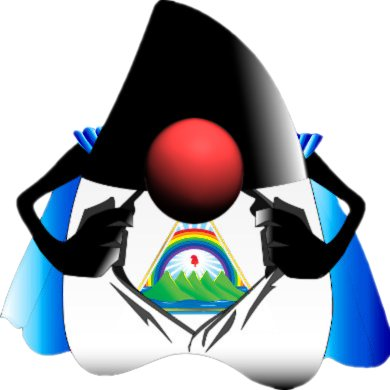
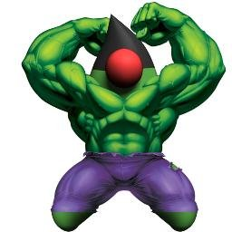

# Our community

 [**Clic aqui para ir a la versión en Español**](README.md)
 
 

La Comunidad Hispana de grupos de usuarios de Java (JUG) inicio en el año 2017 para compartir conocimiento sobre Java y tecnologias relacionadas entre JUGs donde su idioma principal es el Español, mas de 12 grupos de España y Latinoamerica hacen parte de esta comunidad.

Esta comunidad esta programando Hack days cada 2 meses, en donde los interesados pueden ir a la reunión de su JUG local o seguir el evento via YouTube and el canal de Slack.

Los siguientes son los grupos de usuarios de Java que hacen parte de la comunidad

- Barcelona [(@BarcelonaJUG)](https://twitter.com/BarcelonaJUG):
 

- Barranquilla [(@JUGBAQ)](https://twitter.com/JUGBAQ):

- Cali [(@CLOJUG)](https://twitter.com/CLOJUG):

- Chile [(@jug_chile)](https://twitter.com/jug_chile):

- Coruña [(@CorunaJUG)](https://twitter.com/CorunaJUG):

- Ecuador [(@EcuadorJUG)](https://twitter.com/EcuadorJUG):

- Guatemala [(@guatejug)](https://twitter.com/guatejug):

- Madrid [(@MadridJUG)](https://twitter.com/MadridJUG):

- Málaga [(@MalagaJUG)](https://twitter.com/MalagaJUG):

- Medellin [(@MedellinJug)](https://twitter.com/MedellinJug):

- Nicaragua [(@jug_nicaragua)](https://twitter.com/jug_nicaragua):

- Perú [(@perujug)](https://twitter.com/perujug):

- Panama

- Vigo [(@VigoJUG)](https://twitter.com/VigoJUG):

